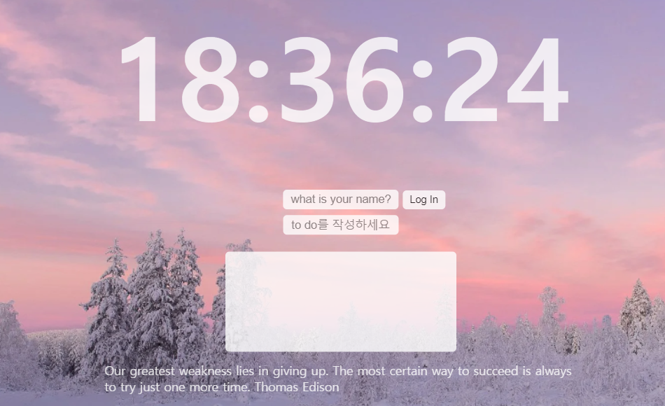

# chrome_app

## 바닐라 JS로 크롬 앱

|||
|--|--|
|<b>⚒️기술스택</b> |HTML/CSS, JavaScript|
|<b>✨한줄소개</b>|프레임워크 쓰지 않고 순수 자바스크립트로만 시간, 투두리스트 구현|
|<b>🚀서비스 내용</b>|메인페이지에 시간과 투두리스트 서비스 제공|
|<b>📃핵심기능</b>|로컬 스토리지로 닉네임과 투두리스트 저장|
|<b>🧑🏻‍💻상세보기</b>|https://jeeumu.tistory.com/71|